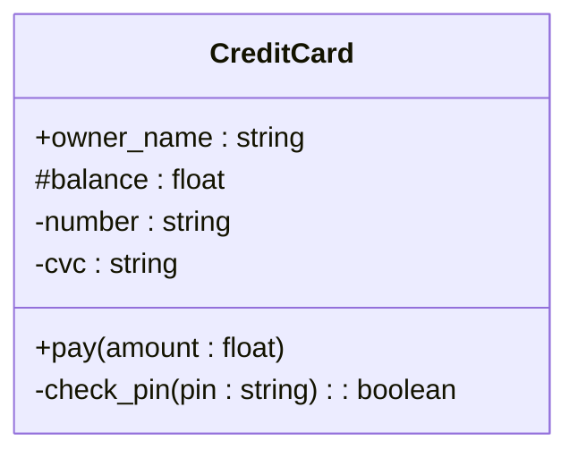
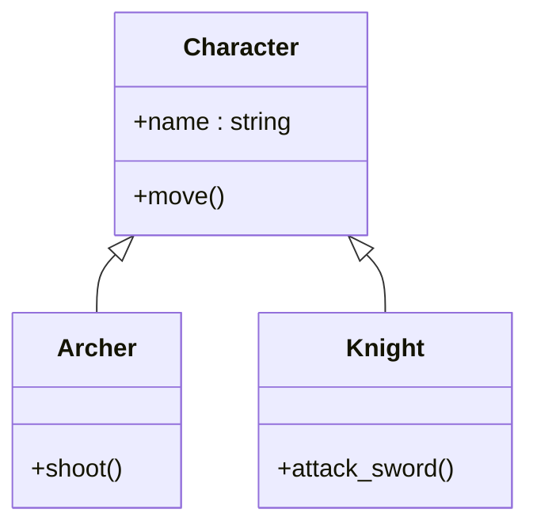
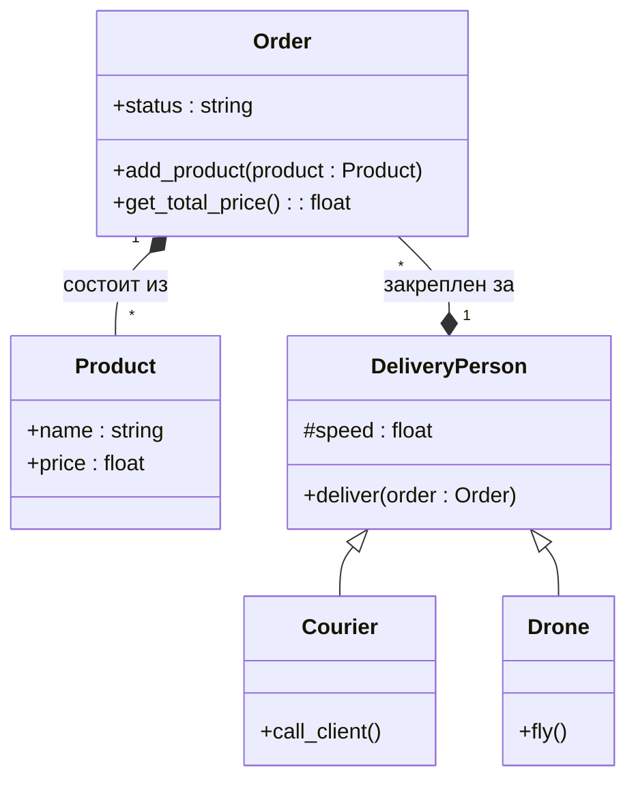
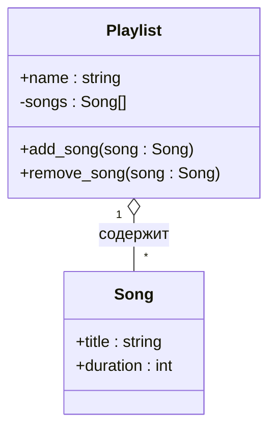

```mermaid
classDiagram
    class CreditCard {
        +owner_name : string
        #balance : float
        -number : string
        -cvc : string
        +pay(amount : float)
        -check_pin(pin : string) : boolean
    }

```

```mermaid
classDiagram
    class Character {
        +name : string
        +move()
    }
    
    class Archer {
        +shoot()
    }
    
    class Knight {
        +attack_sword()
    }
    
    Character <|-- Archer
    Character <|-- Knight
```

```mermaid
classDiagram
    class Product {
        +name : string
        +price : float
    }
    
    class Order {
        +status : string
        +add_product(product : Product)
        +get_total_price() : float
    }
    
    class DeliveryPerson {
        #speed : float
        +deliver(order : Order)
    }
    
    class Courier {
        +call_client()
    }
    
    class Drone {
        +fly()
    }
    
    Order "*" --* "1" DeliveryPerson : закреплен за
    Order "1" *-- "*" Product : состоит из
    DeliveryPerson <|-- Courier
    DeliveryPerson <|-- Drone
```

```mermaid

classDiagram
    class Song {
        +title : string
        +duration : int
    }
    
    class Playlist {
        +name : string
        -songs : Song[]
        +add_song(song : Song)
        +remove_song(song : Song)
    }
    
    Playlist "1" o-- "*" Song : содержит
```
