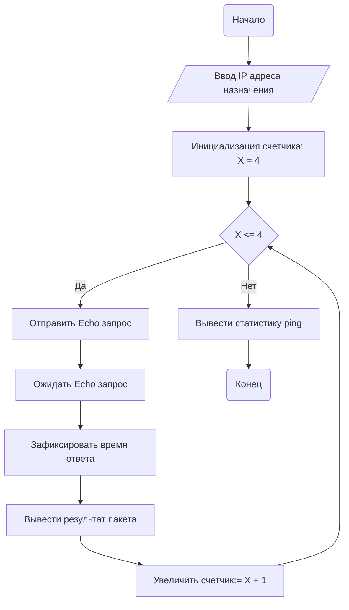
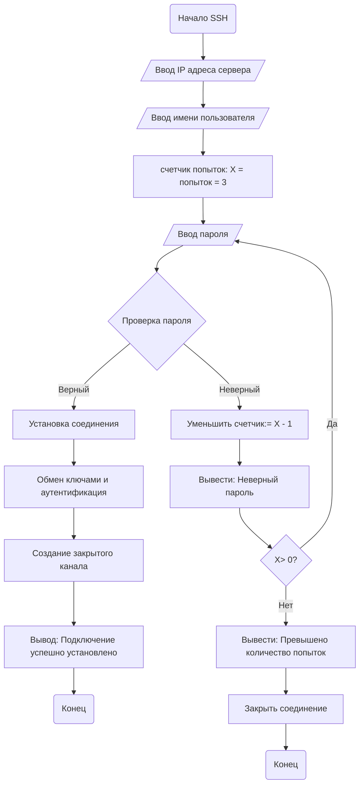
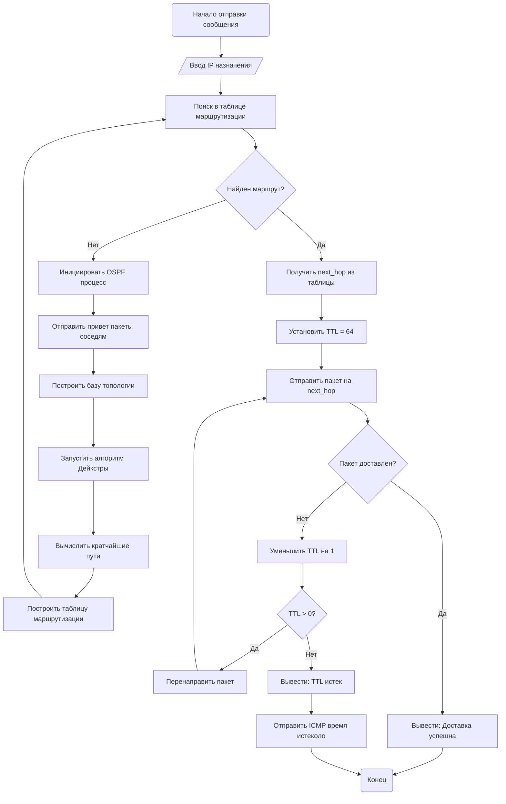
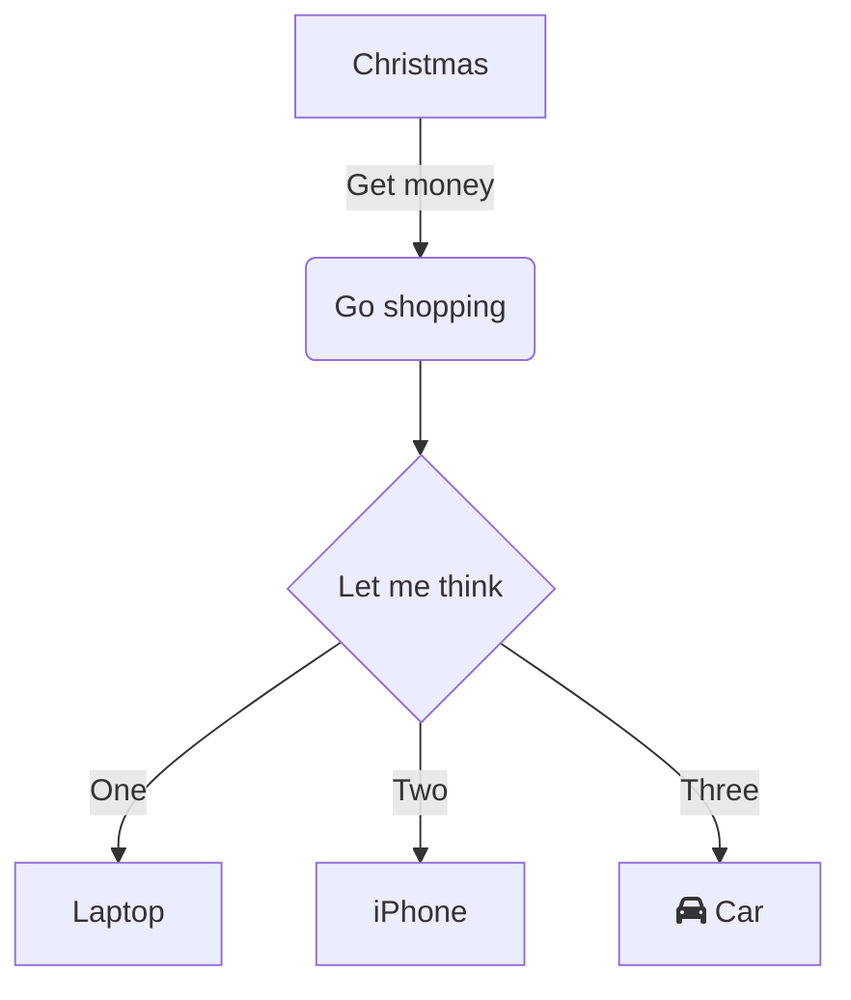

```mermaid

flowchart TD
    A(Начало) --> B[/Ввод IP адреса назначения/]-->D
    D[Инициализация счетчика: X = 4]
    D --> E{X <= 4}
    
    E -- Да --> F[Отправить Echo запрос]
    F --> G[Ожидать Echo запрос ]
    G --> H[Зафиксировать время ответа]
    H --> I[Вывести результат пакета]
    I --> J[Увеличить счетчик:= X + 1]
    J --> E
    E -- Нет --> K[Вывести статистику ping]
    K --> L(Конец)
```

```mermaid

flowchart TD
    A(Начало SSH) --> B[/Ввод IP адреса сервера/]
    B --> C[/Ввод имени пользователя/]
    C --> D[ счетчик попыток: X = попыток = 3]
    D --> E[/Ввод пароля/]
    E --> F{Проверка пароля}
    
    F -- Верный --> G[Установка соединения]
    G --> H[Обмен ключами и аутентификация]
    H --> I[Создание закрытого канала]
    I --> J[Вывод: Подключение успешно установлено]
    J --> K(Конец)
    
    F -- Неверный --> L[Уменьшить счетчик:= X - 1]
    L --> M[Вывести: Неверный пароль]
    M --> N{X> 0?}
    
    N -- Да --> E
    N -- Нет --> O[Вывести: Превышено количество попыток]
    O --> P[Закрыть соединение]
    P --> Q(Конец)
```

```mermaid
flowchart TD
    A(Начало отправки сообщения) --> B[/Ввод IP назначения/]
    B --> C[Поиск в таблице маршрутизации]
    C --> D{Найден маршрут?}
    
    D -- Нет --> E[Инициировать OSPF процесс]
    E --> F[Отправить привет пакеты соседям]
    F --> G[Построить базу топологии ]
    G --> H[Запустить алгоритм Дейкстры]
    H --> I[Вычислить кратчайшие пути]
    I --> J[Построить таблицу маршрутизации]
    J --> C
    
    D -- Да --> K[Получить next_hop из таблицы]
    K --> L[Установить TTL = 64]
    L --> M[Отправить пакет на next_hop]
    M --> N{Пакет доставлен?}
    
    N -- Да --> O[Вывести: Доставка успешна]
    O --> P(Конец)
    
    N -- Нет --> Q[Уменьшить TTL на 1]
    Q --> R{TTL > 0?}
    
    R -- Да --> S[Перенаправить пакет]
    S --> M
    
    R -- Нет --> T[Вывести: TTL истек]
    T --> U[Отправить ICMP время истеколо]
    U --> P
    
```

```mermaid
flowchart TD

    A[Christmas] -->|Get money| B(Go shopping)

    B --> C{Let me think}

    C -->|One| D[Laptop]

    C -->|Two| E[iPhone]

    C -->|Three| F[fa:fa-car Car]
```