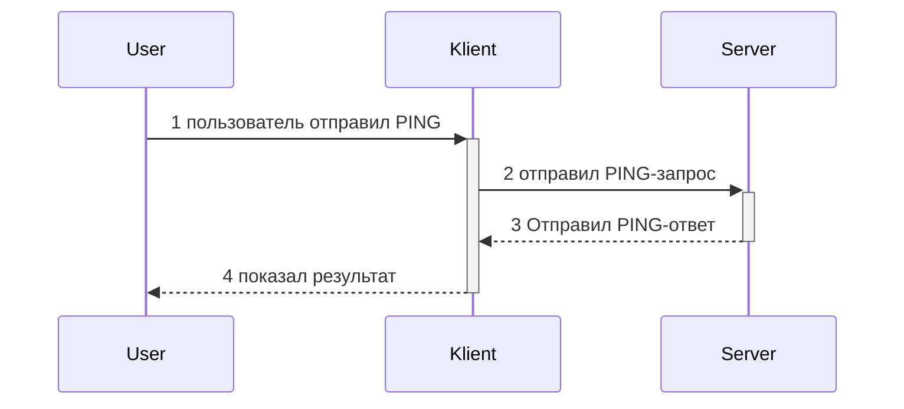
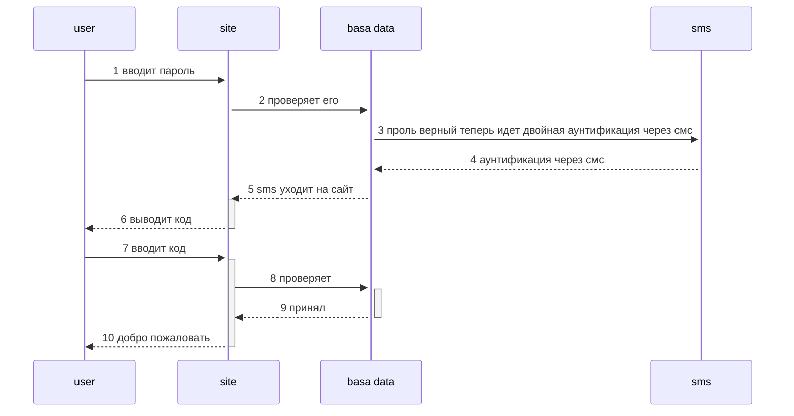
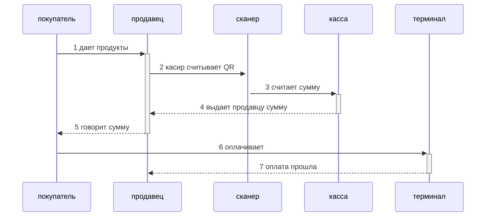
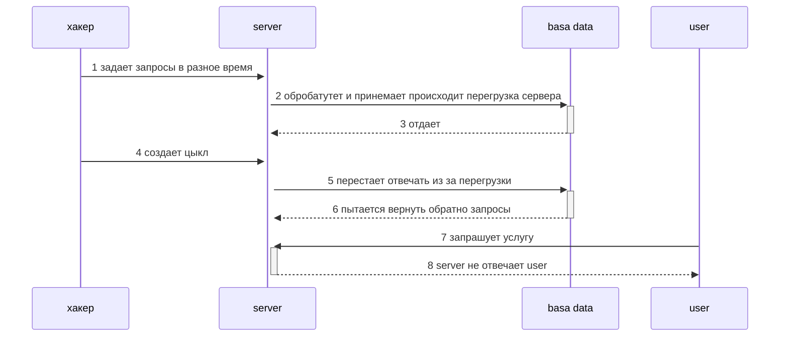

```mermaid
sequenceDiagram

User->>+Klient :1 пользователь отправил PING

Klient->>+Server :2 отправил PING-запрос

Server-->>-Klient :3 Отправил PING-ответ

Klient-->>-User :4 показал результат
```

2 задание

```mermaid
sequenceDiagram

user->>+site :1 вводит пароль

site->>+basa data :2 проверяет его

basa data->>+sms :3 проль верный теперь идет двойная аунтификация через смс

sms-->>+basa data :4 аунтификация через смс

basa data-->>+site :5 sms уходит на сайт

site-->>-user :6 выводит код

user->>+site :7 вводит код

site->>+basa data :8 проверяет

basa data-->>-site :9 принял

site-->>-user :10 добро пожаловать
```
3 задание

```mermaid
sequenceDiagram

покупатель->>+продавец :1 дает продукты

продавец->>+сканер :2 касир считывает QR

сканер->>+касса :3 считает сумму

касса-->>-продавец : 4 выдает продавцу сумму

продавец-->>-покупатель : 5 говорит сумму

покупатель->>+терминал :6 оплачивает

терминал-->>-продавец :7 оплата прошла
```
задание 4

```mermaid
sequenceDiagram

хакер->>+server :1 задает запросы в разное время

server->>+basa data :2 обробатутет и принемает происходит перегрузка сервера

basa data-->>-server :3 отдает

хакер->>+server :4 создает цыкл

server->>+basa data :5 перестает отвечать из за перегрузки

basa data-->>-server :6 пытается вернуть обратно запросы

user->>+server :7 запрашует услугу

server -->>-user : 8 server не отвечает user
```
