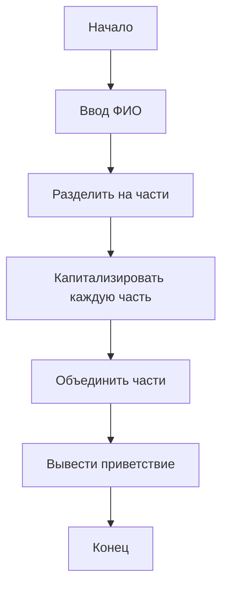
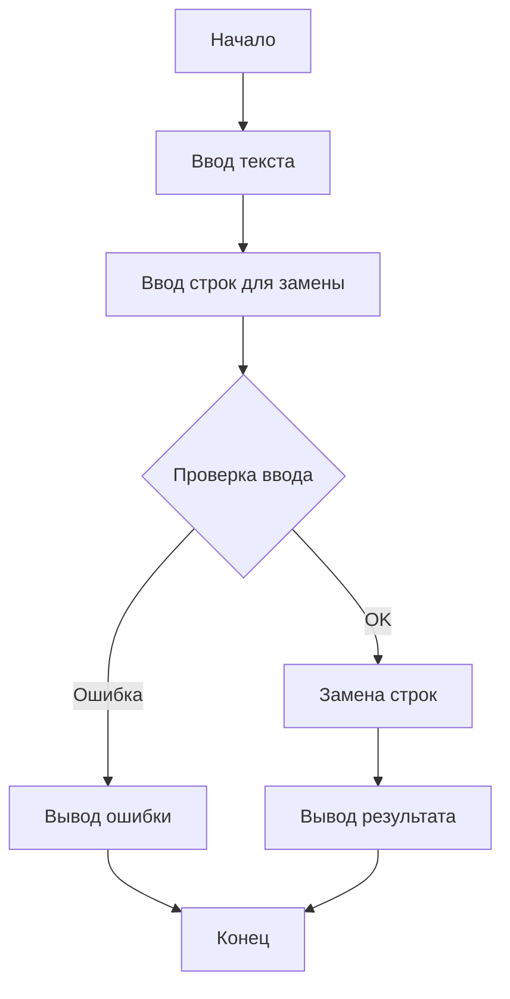
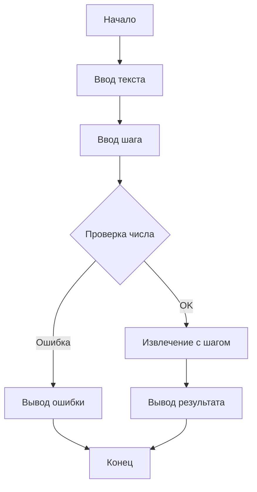
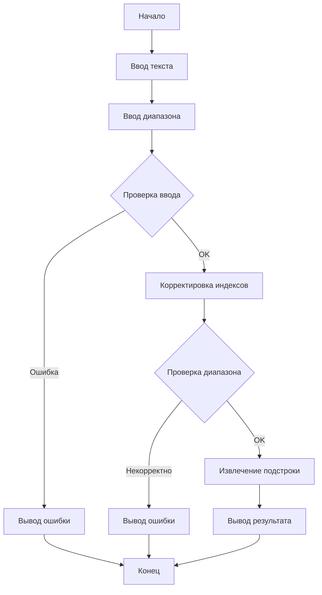
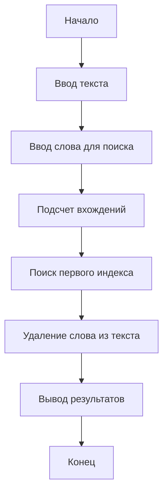

```mermaid
graph TD
    A[Начало] --> B[Ввод ФИО]
    B --> C[Разделить на части]
    C --> D[Капитализировать каждую часть]
    D --> E[Объединить части]
    E --> F[Вывести приветствие]
    F --> G[Конец]
```

```mermaid
graph TD
    A[Начало] --> B[Ввод текста]
    B --> C[Ввод строк для замены]
    C --> D{Проверка ввода}
    D -->|Ошибка| E[Вывод ошибки]
    D -->|OK| F[Замена строк]
    E --> G[Конец]
    F --> H[Вывод результата]
    H --> G
```

```mermaid
graph TD
    A[Начало] --> B[Ввод текста]
    B --> C[Ввод шага]
    C --> D{Проверка числа}
    D -->|Ошибка| E[Вывод ошибки]
    D -->|OK| F[Извлечение с шагом]
    E --> G[Конец]
    F --> H[Вывод результата]
    H --> G
```

```mermaid
graph TD
    A[Начало] --> B[Ввод текста]
    B --> C[Ввод диапазона]
    C --> D{Проверка ввода}
    D -->|Ошибка| E[Вывод ошибки]
    D -->|OK| F[Корректировка индексов]
    E --> G[Конец]
    F --> H{Проверка диапазона}
    H -->|Некорректно| I[Вывод ошибки]
    H -->|OK| J[Извлечение подстроки]
    I --> G
    J --> K[Вывод результата]
    K --> G
```

```mermaid
graph TD
    A[Начало] --> B[Ввод текста]
    B --> C[Ввод слова для поиска]
    C --> D[Подсчет вхождений]
    D --> E[Поиск первого индекса]
    E --> F[Удаление слова из текста]
    F --> G[Вывод результатов]
    G --> H[Конец]
```

